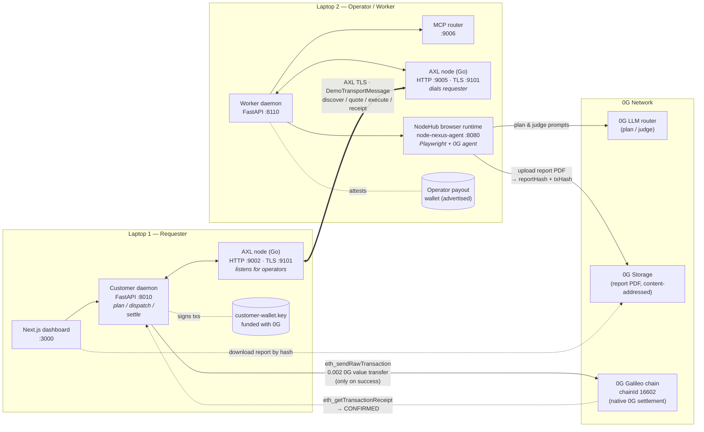

## NodeHub: a verifiable WebOps on AXL

This repository ships an opinionated reference application built on top of AXL: **NodeHub**, a peer-to-peer marketplace where requesters dispatch browser-automation jobs (and lightweight HTTP probes) to remote operators, receive cryptographically signed receipts, and pay the worker on completion in native 0G.

The application is a two-laptop demo by default:

- **Laptop 1 — Requester** runs a Next.js dashboard, a FastAPI customer daemon, and an AXL node configured as a TLS listener on `:9101`. Operators register with the requester, the requester plans + dispatches jobs, and at the end pays out in 0G.
- **Laptop 2 — Operator/Worker** runs a worker daemon, an MCP router, an AXL node that dials into the requester, and the **NodeHub browser runtime** (`node-nexus-agent`) which drives a real Chromium session, captures screenshots and a PDF, and uploads the artifact to 0G Storage.

Browse `platform/` for the application layer, `node-nexus-agent/` for the browser runtime, and `internal/` for the AXL/Yggdrasil node code that this app rides on top of.

### How AXL is used

NodeHub uses AXL purely as the transport layer. There is no central server, no relay, no broker — everything an operator and a requester exchange flows over a direct TLS link between their AXL nodes.

- **Peering.** Each side runs a local AXL node (`./node -config …`). The requester's node listens on `tls://0.0.0.0:9101`; the operator's node has the requester listed in `Peers`. Once peered, the AXL mesh assigns each peer an Yggdrasil-derived IPv6 address and exposes it locally via the AXL HTTP API on `:9002` (requester) / `:9005` (operator).
- **Application-layer messaging.** All NodeHub messages — node advertisements, capability discovery, quote requests, execution requests, signed execution receipts, attestations — are encoded as JSON `DemoTransportMessage`s and shipped through AXL's `POST /send` (with `X-Destination-Peer-Id`) on the sender side and `GET /recv` on the receiver side. The customer/worker daemons each run a `recv_loop` that polls AXL and dispatches by `kind` (see `platform/daemon/service.py`).
- **Identity = peer ID.** A node's AXL public key is its peer identity. Worker advertisements are signed envelopes (EIP-191) keyed to that public key, so any receiver can verify provenance without trusting any third party.
- **No port forwarding, no TUN.** Because AXL connects outbound and reuses the connection for return traffic, operators behind home NATs can serve jobs without router config — only the laptop running as the public seed needs an inbound port (and on macOS, a one-time Application Firewall whitelist via `platform/operator/configure_firewall.sh`).

### How 0G is used

NodeHub uses 0G in two complementary ways: as **decentralized storage** for the artifact a job produces, and as **the settlement chain** the requester pays the worker on.

- **0G Storage — verifiable evidence of work.** When the browser runtime finishes a task, it renders the captured screenshots into a PDF report and uploads it to **0G Storage testnet** via the `0g-ts-sdk`-backed uploader in `node-nexus-agent/src/zeroGStorage.js`. The upload returns a content-addressed `reportHash` (Merkle root) and a `txHash` of the storage commitment, both of which the worker bakes into its signed `execution_receipt`. The requester (and anyone else) can later fetch the report straight from `https://indexer-storage-testnet-turbo.0g.ai/file?root=<reportHash>` and re-verify the bytes match the receipt — the worker can't tamper with the artifact after the fact. Configuration: `ZEROG_API_KEY`, `ZEROG_PRIVATE_KEY`, `ZEROG_STORAGE_RPC_URL=https://evmrpc-testnet.0g.ai`, `ZEROG_STORAGE_INDEXER_RPC=https://indexer-storage-testnet-turbo.0g.ai`.

- **0G Storage — agent runtime.** The browser-driving agent itself (`node-nexus-agent/python-agent/`) calls the **0G LLM router** (`https://router-api-testnet.integratenetwork.work/v1`) for plan/perceive/judge inference, so the work that produces the evidence is also performed against 0G's network rather than a centralized provider.

- **0G Chain — native-token settlement.** When the requester's customer daemon observes a successful `execution_receipt`, it constructs a native-value transaction on the **0G Galileo testnet** (`chainId 16602`, RPC `https://evmrpc-testnet.0g.ai`) sending `0.002 0G` to the worker's payout wallet (advertised in the operator's onboarding env via `NODEHUB_WORKER_PAYOUT_WALLET`). The transaction is signed locally with `eth-account`, broadcast via `eth_sendRawTransaction`, and the resulting `tx_hash` is recorded on a `SettlementRecord` that walks `PENDING → TRIGGERED → CONFIRMED` once `eth_getTransactionReceipt` confirms `status=0x1`. The dashboard surfaces the tx with a clickable link to `https://chainscan-galileo.0g.ai/tx/{hash}`. Failed jobs do not pay — the broadcast is gated on `result.success == true`.

### Architecture



### End-to-end flow of one job

1. Requester picks a region in the dashboard and submits `{ task_type: "browser_task", inputs: { url, task } }` to the customer daemon.
2. Customer daemon plans the job, looks up live operators in that region from its signed advertisement store, and ships an `execution_request` over AXL to the chosen worker.
3. Worker daemon hands the request to `node-nexus-agent`, which spins up Playwright and an agent loop driven by the 0G LLM router; the agent navigates, screenshots each step, then renders a PDF.
4. The PDF is uploaded to 0G Storage. The worker signs an `execution_receipt` containing `reportHash`, `txHash`, screenshots, and the worker's payout wallet, and sends it back over AXL.
5. The customer daemon verifies the envelope, persists it to its local event log, and the dashboard renders the report with a 0G-Storage download link.
6. The reconcile loop notices a new successful receipt, builds a `SettlementRecord(amount=0.002, currency=0G, network=0g-galileo)`, signs and broadcasts a native transfer to the worker's wallet, then watches `eth_getTransactionReceipt` until the settlement is `CONFIRMED`. The dashboard shows the explorer link.

### Running the demo

```bash
# Laptop 1 (requester)
make build
export NODEHUB_OPERATOR_SEED_PEER=tls://<laptop-2-lan-ip>:9101
./Start

# Laptop 2 (operator)
sudo ./platform/operator/configure_firewall.sh           # macOS: whitelist node binary
./OnboardWorker \
  --label "Tokyo Worker" --region tokyo --country JP \
  --payout-wallet 0x... --capabilities browser_task \
  --seed-peer tls://<laptop-1-lan-ip>:9101
```

Fund `platform/demo/runtime/customer-wallet.key` from https://faucet.0g.ai before submitting a job — without 0G in the requester wallet, settlements transition to `FAILED` instead of `CONFIRMED`.

## Documentation

| Document | Contents |
|----------|----------|
| [Architecture](docs/architecture.md) | System diagram, how it works, wire format, submodules |
| [HTTP API](docs/api.md) | All endpoints: `/topology`, `/send`, `/recv`, `/mcp/`, `/a2a/` |
| [Configuration](docs/configuration.md) | Build/run, CLI flags, `node-config.json` |
| [Integrations](docs/integrations.md) | Python services: MCP router, A2A server, test client |
| [Examples](docs/examples.md) | Remote MCP server, adding A2A |

## Citation

If you use AXL in your research or project, please cite it as follows:

**BibTeX:**

```bibtex
@misc{gensyn2026axl,
  title         = {{AXL}: A P2P Network for Decentralized Agentic and {AI/ML} Applications},
  author        = {{Gensyn AI}},
  year          = {2026},
  howpublished  = {\url{[https://github.com/gensyn-ai/axl](https://github.com/gensyn-ai/axl)}},
  note          = {Open-source software}
}
```
